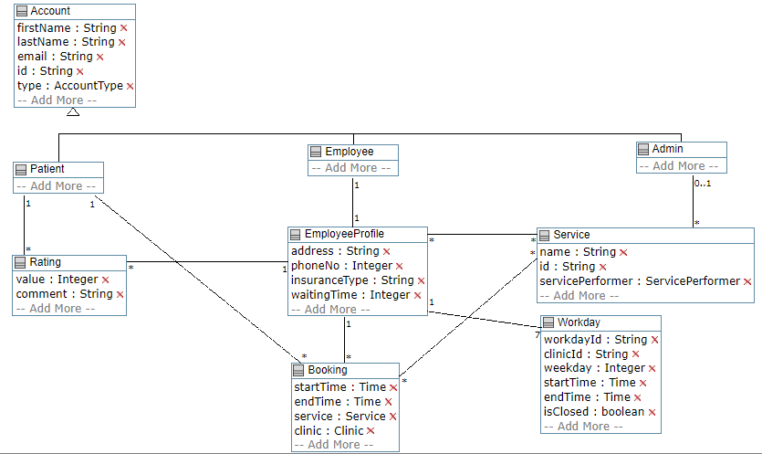

# Clinic Application

This repository contains all files for the final deliverable of the final project for SEG2505 (Intro to Software Engineering) in Fall 2019. 

This Android application provides a variety of functionality for a fictional clinic. It is developed primarily in Java, and uses a Firebase database.

## Functionality

Admins can:

* Add or remove employee or patient accounts.

* Create services that the clinic can offer to patients.

Employees can:

* Create an account to use on the clinic.

* Select services and create a fee for each service.

* Enter their work hours at the clinic.

Patients can:

* Create an account to use on the clinic.

* Search a clinic by its address, services, or work hours.

* Check in or book an appointment.

* Rate their experience at the clinic

## Sample Accounts :

**Admin** E-mail : admin@admin.com   Password : admin123

**Employee** E-mail : employee@employee.com   Password : employee123

**Patient** E-mail : patient@patient.com   Password : patient123

## UML Model

https://cruise.eecs.uottawa.ca/umpleonline/umple.php?model=191017190915983
